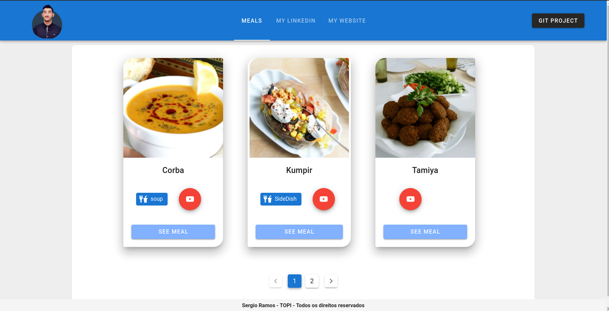
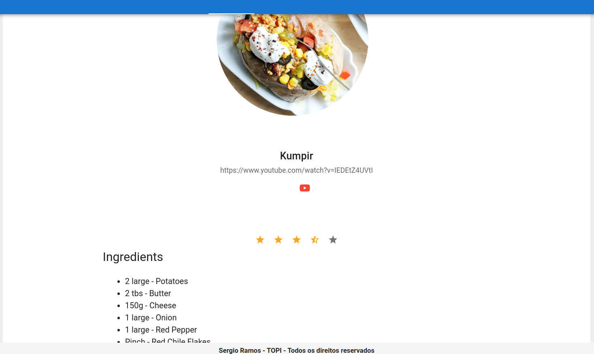

# Full Stack Developer Test

Para este projeto o desafio é desenvolver um backend que estruture estes [JSON de dados](https://www.themealdb.com/api/json/v1/1/search.php?s=), forneça os dados via API, e construir um frontend que consuma esses dados, mostrando-os. 

### Os requisitos são:
* You NEED to develop both the front-end and the back-end.
* Display a list of the meals with each row containing: name, category, area, thumbnail and the cooking instructions
* There must be a search bar to search for the meals
* Readable code (variable names, structures)
* Paging or infinite scrolling
* At least one unit test
* Deploy to a server (AWS, Heroku, Azure, etc)

## Resolução do Desafio:

**Banco de Dados MYSQL**
Para resolver este desafio, primeiro analisei os dados contidos no Json fornecido e imaginei/desenhei quais tecnologias seriam usadas para estrutura-lo. Basicamente, criei 3 tabelas (Meals, Categories, Areas). 
Dentro da tabela Meals, vi no Json que os dados de Igredientes, Medida e Tags poderiam ser bastante variados. Para resolver este problema, usei colunas Json, que possui bastante flexibilidade para tratar os dados, principalmente quando se trata de variabilidade. 

**Layout estrutural do projeto**

Para estruturar o projeto melhor, costumo separar o que é de backend do que é de frontend. Logo, teremos duas pastas do projeto, uma para o Backend com todo gerenciamento de rotas, banco de dados, MVC, tratamento de erros, etc... E uma para o frontend, um SPA (single page application) construido com o framework Vue.js, com gerencimento de rotas (VueRouter), Axios (Client HTTP), e template UI Vuetify.

**Backend - PHP - Laravel**

Para estruturar o backend, utilizei o PHP 8 e Laravel 8, que juntos fornecem uma estrutura completa aumentando significativamente a produtividade do desenvolvedor. Estruturei o projeto com as camadas que o Laravel fornece e ainda adicionei algumas camadas para boas práticas de organização de código. São elas, (Repositories, Interfaces, Traits). 

**Frontend - Javascript - Vue.js**

E na estruturação do frontend, construimos um projeto com CLI do Vue e adicionamos o pacote VueRouter. Eu costumo dividir as responsabilidade dos arquivos, então teremos algumas pastas importantes como a http, pra gerenciar as configurações do axios e criar os objetos que conterão os services.js (Configurações de requisições). Assim também, os routes.js, e os index.js trazendo modularidade pro projeto, conforme sua necessidade de crescimento basta importarmos os novos files e trazer seus recursos para o projeto. 

Segue as telas do projeto:

#### Tela inicial com paginação dos pratos

#### Tela do prato com informações de igredientes e instruções de preparo
